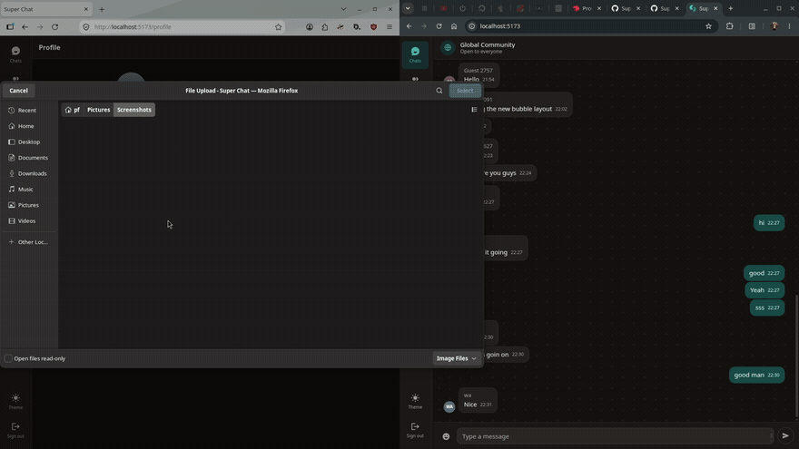
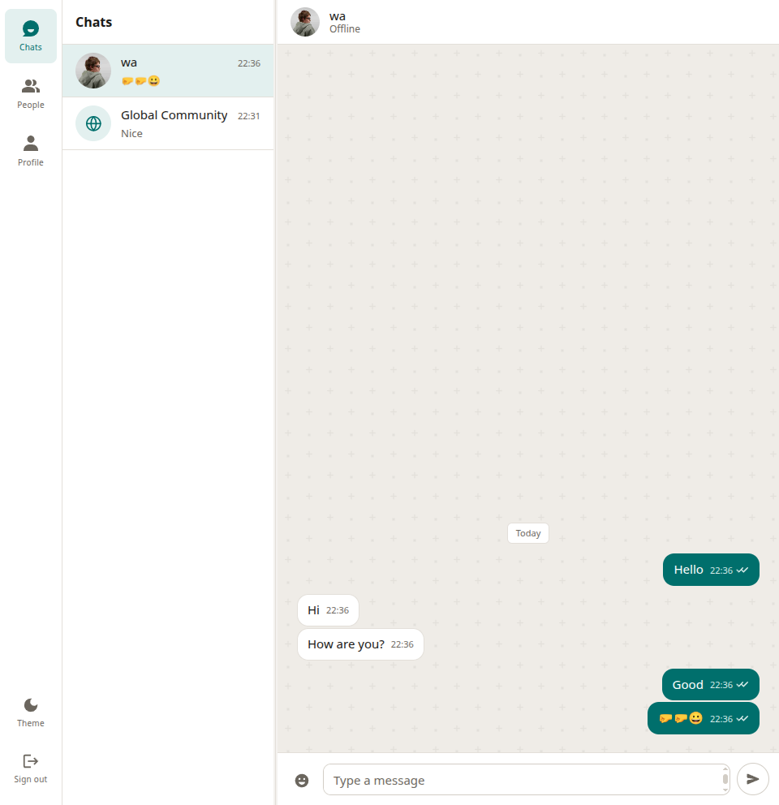
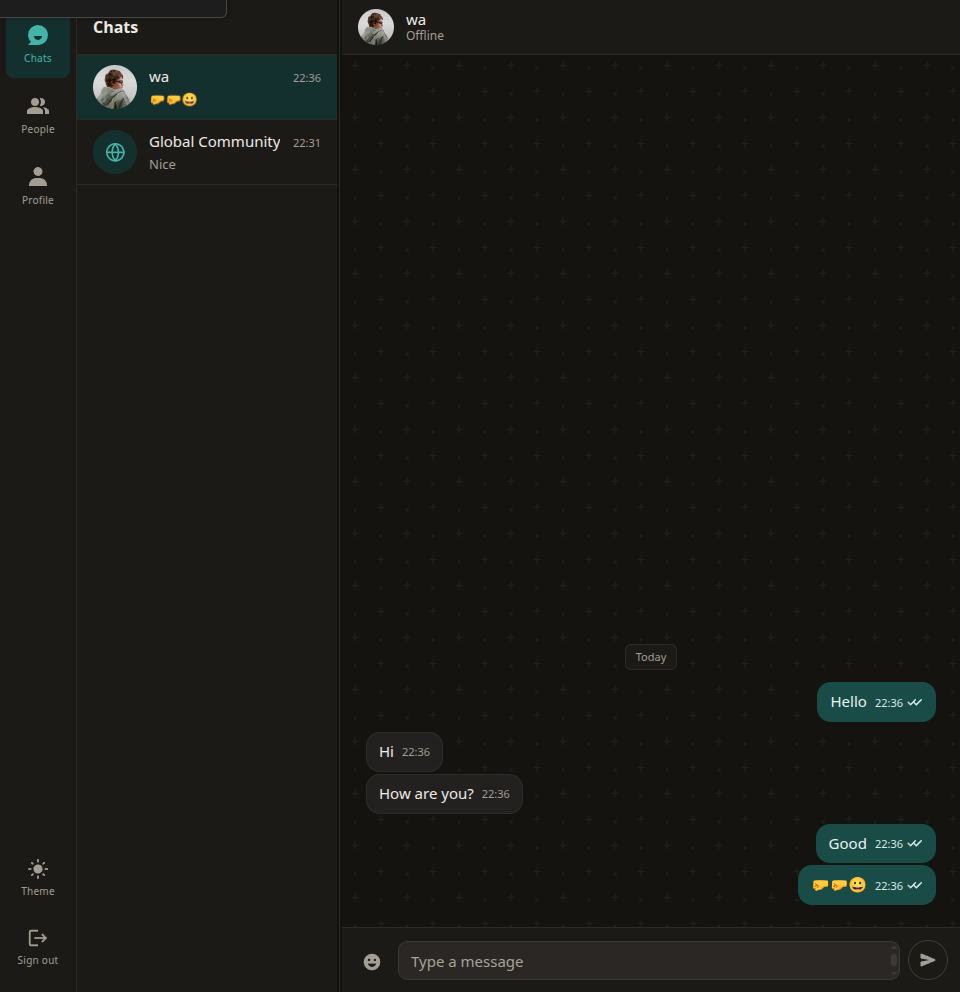
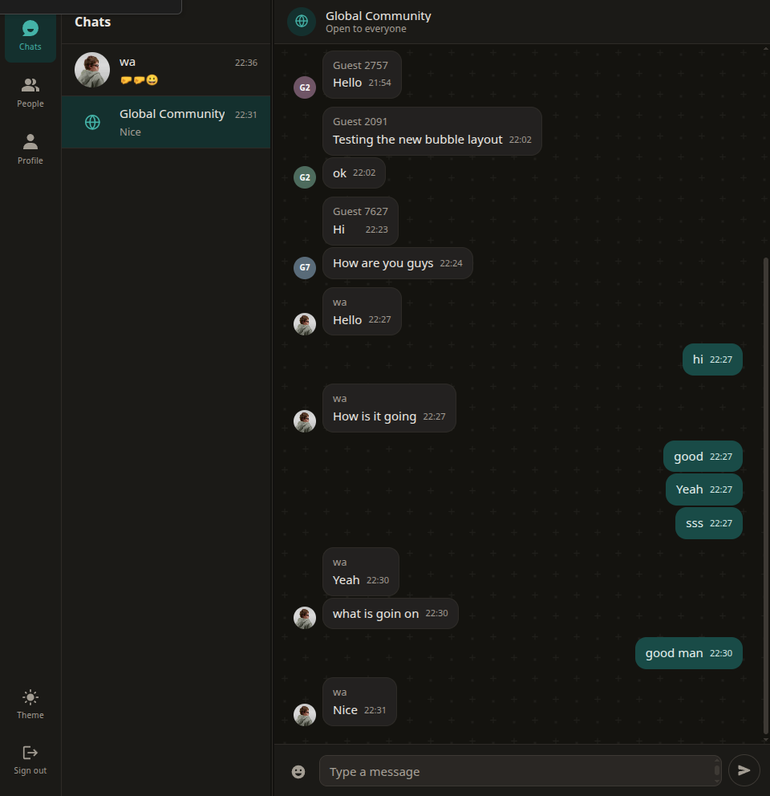
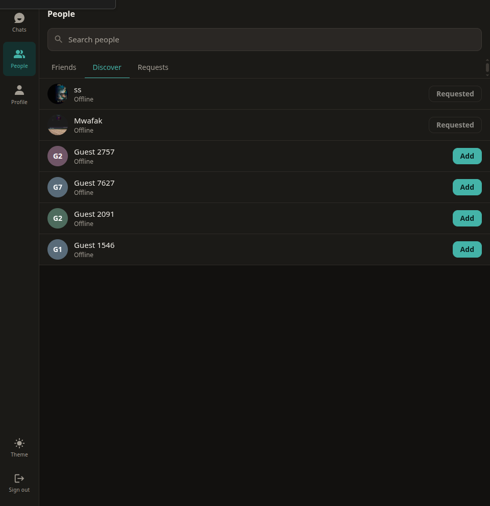
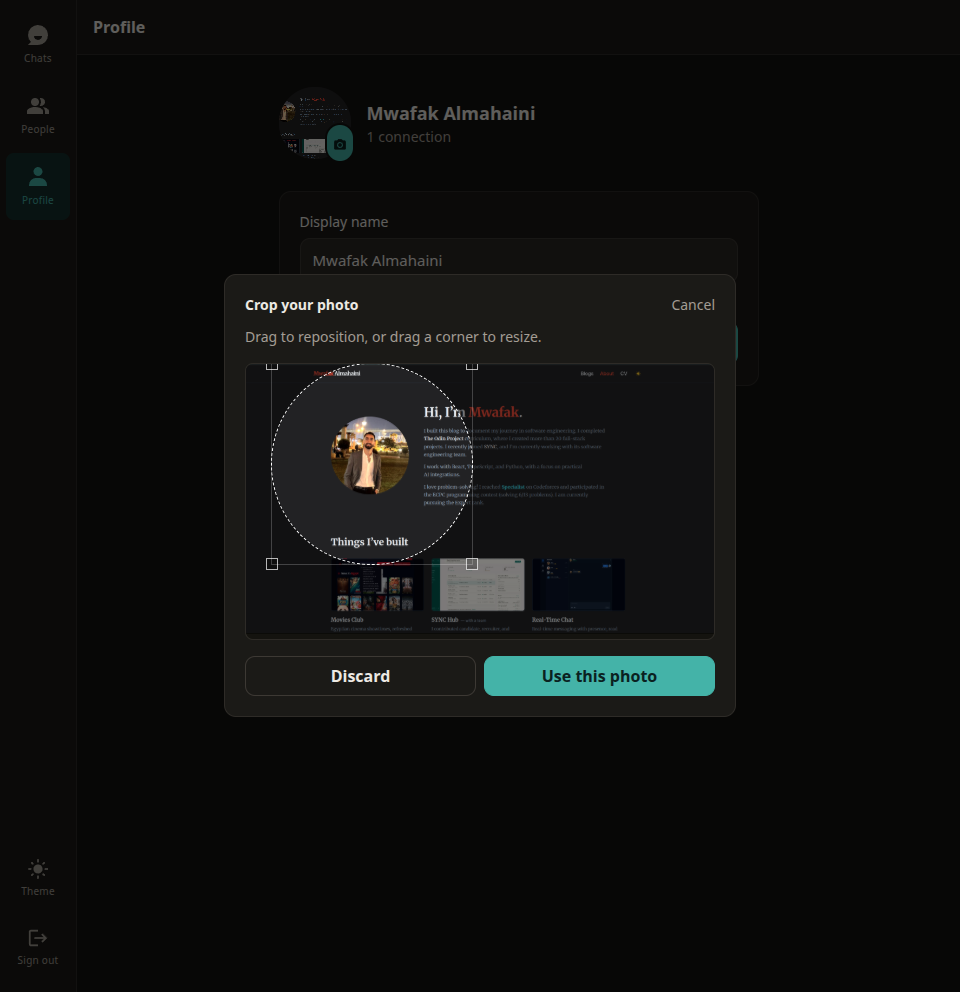

full-stack chat application built for real-time communication. it includes `push notification`, `online status`, `Friend requests`, `live seen messages indicators`, `message pagination on scroll` and much more.
This project is part of my full stack learning journey 

<video src="./project-images/video.webm" width="100%" controls autoplay loop muted></video>

Frontend:

Backend:

Database:

